结构模式：如何将对象和类组装成较大的结构，并同时保持结构的灵活和高效。

## 意图

+ 代理模式：提供对象的替代品，代理控制着对于原对象的访问，并允许在将请求提交给对象前后进行一些处理。
+ 桥接模式：将一个大类或一系列紧密相关的类拆分为抽象和实现两个独立的层次结构，从而能在开发时分别使用。
+ 装饰器模式：装饰器模式在不改变原始类接口的情况下，对原始类功能进行增强，并且支持多个装饰器的嵌套使用。
+ 适配器模式：是一种事后补救策略，适配器提供根原始类不同的接口，而代理模式、装饰器模式提供的都是跟原始类相同的接口。
+ 门面模式；接口整合，解决多接口带来的问题。能为程序库、框架或其他复杂类提供一个简单的接口。
+ 组合模式：使用它将对象组合成树状结构，并且能像使用独立对象一样使用它们。
+ 享元模式：摒弃了在每个对象中保存所有数据的方式，通过共享多个对象公有的相同状态，在有限的内存空间载入更多对象。

## 具体项目中的类图

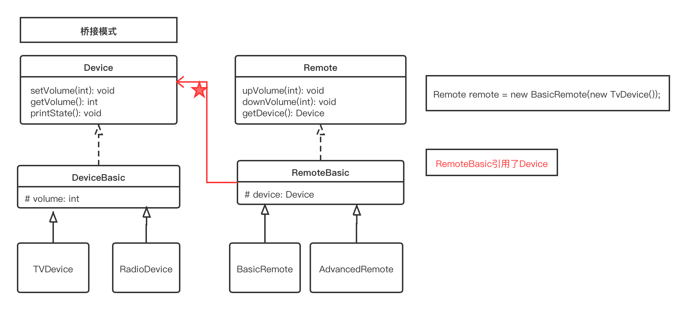

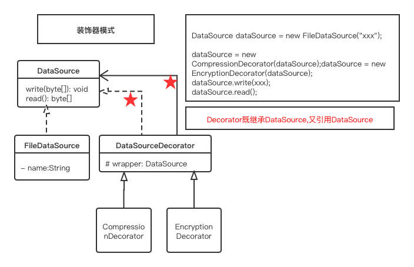

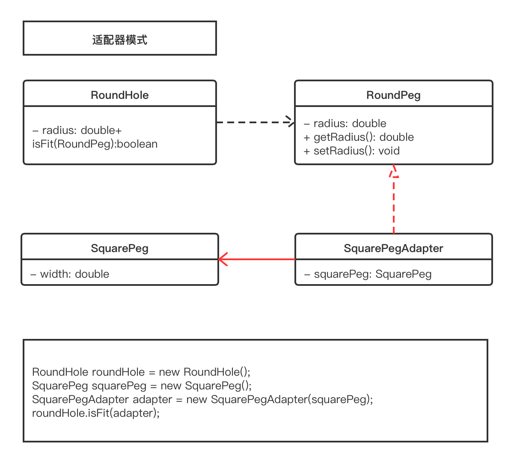

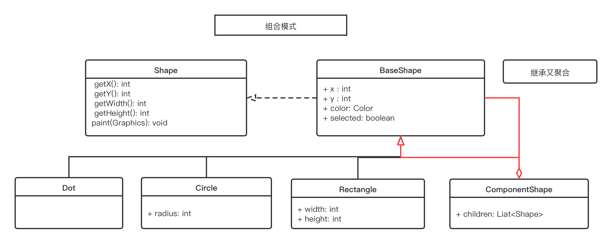

## 抽象类图
摘录自：（https://refactoringguru.cn)

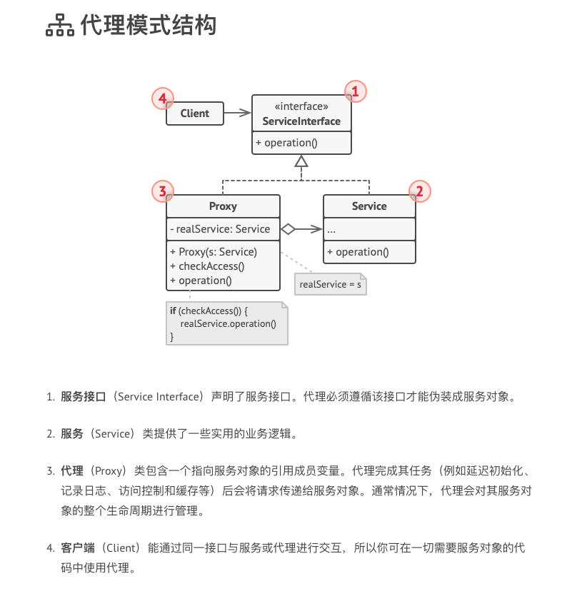

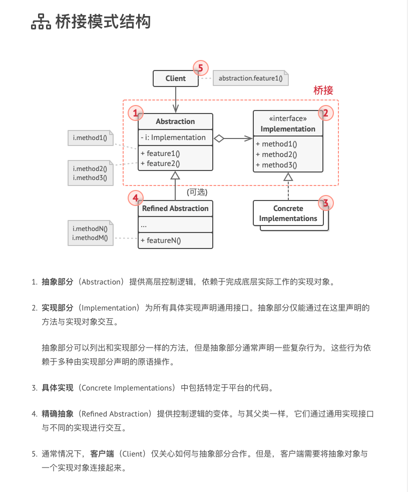

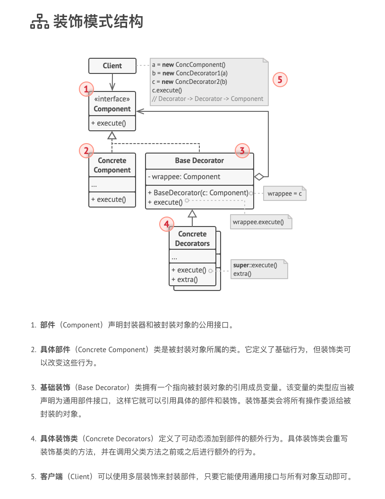

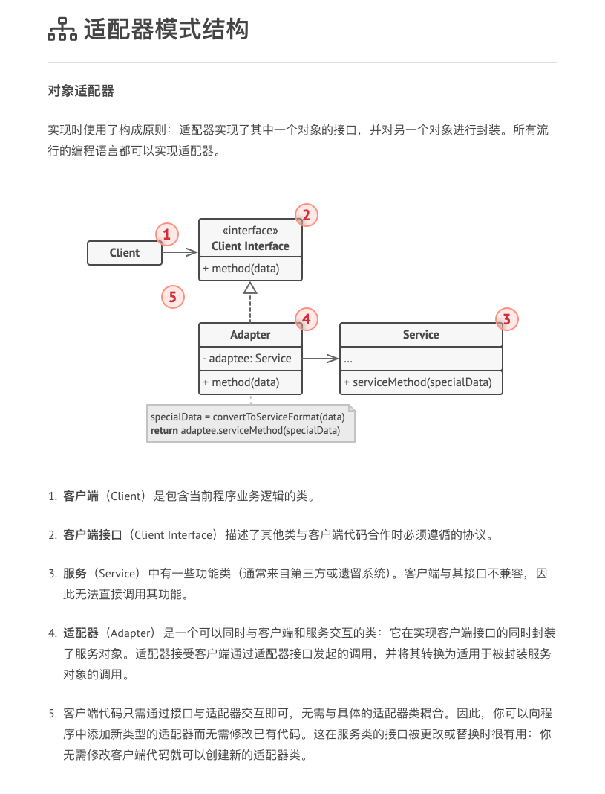

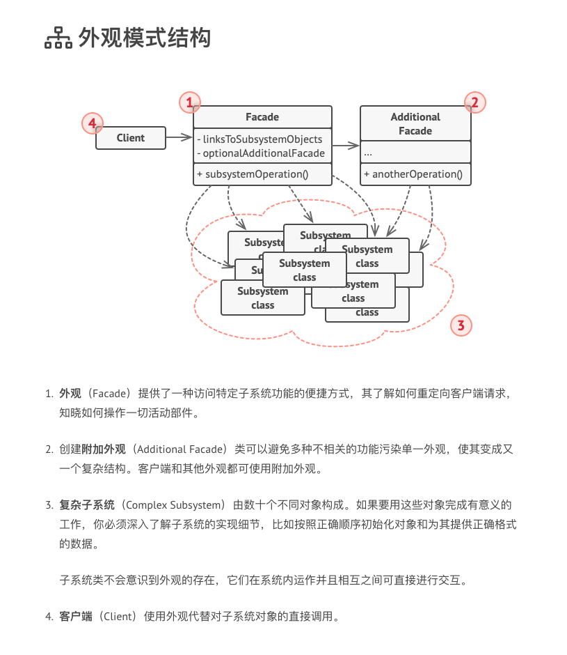

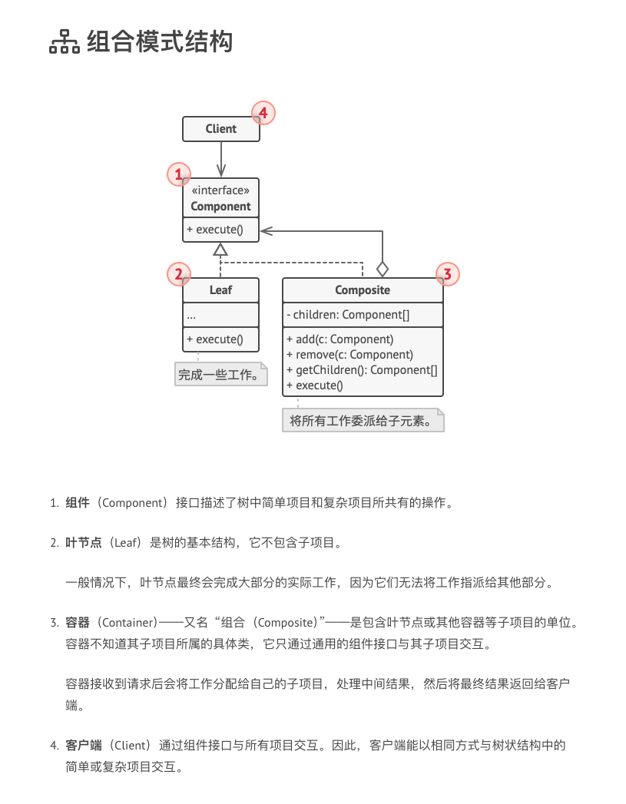

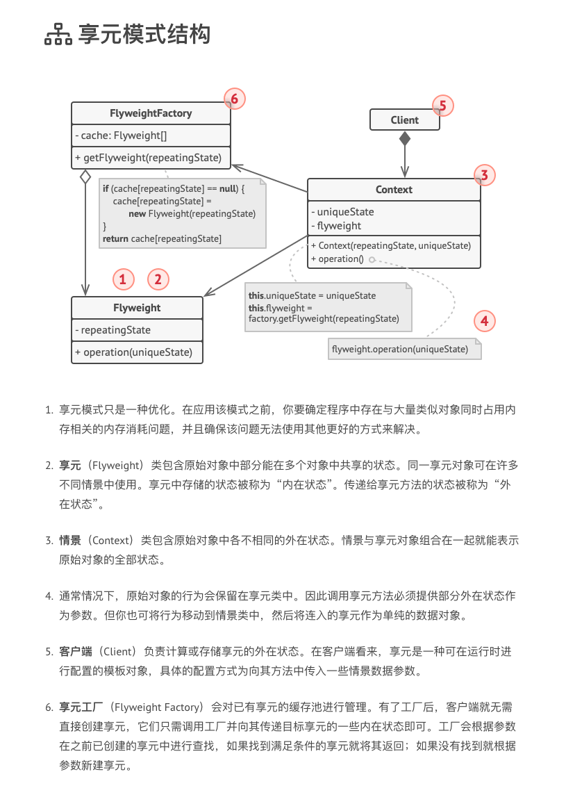
